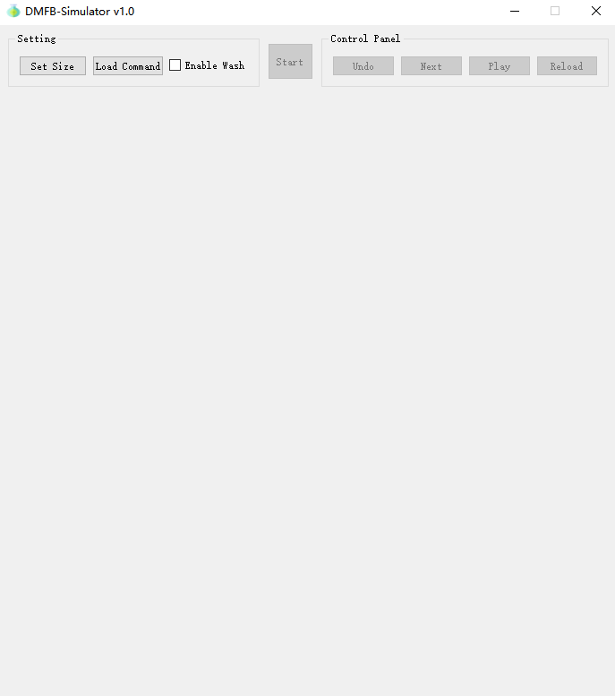
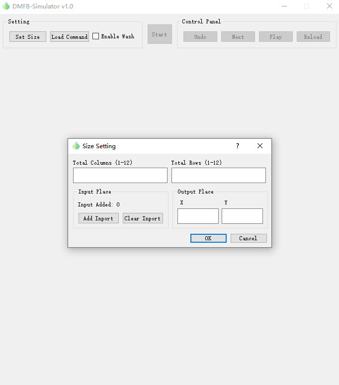
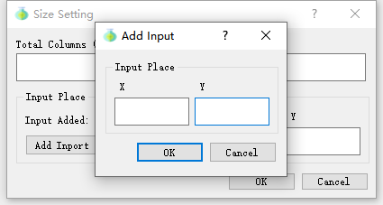
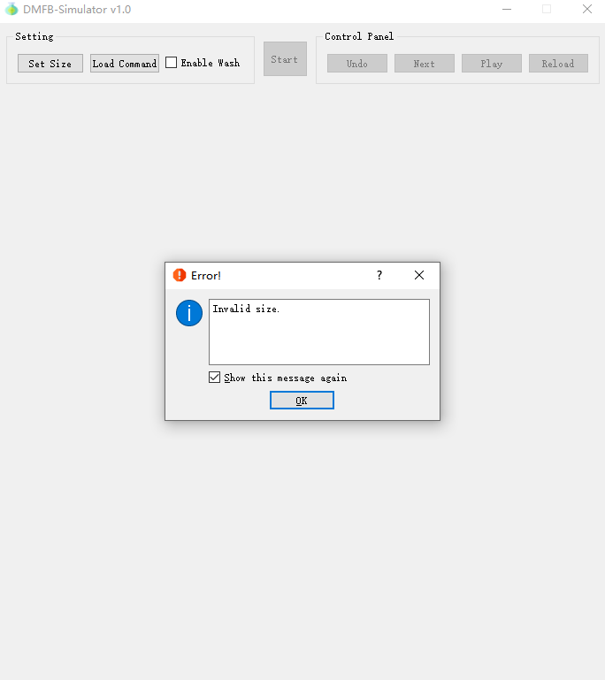
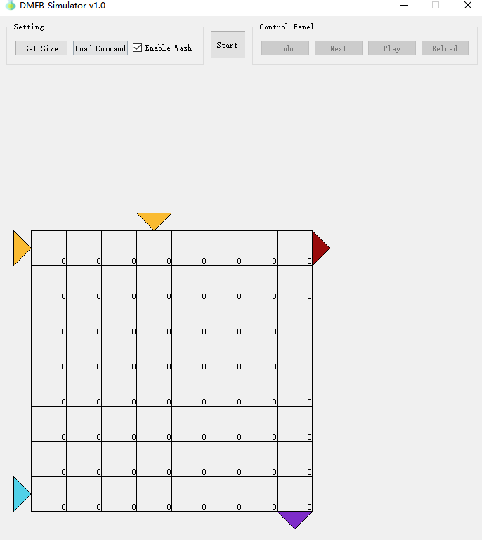
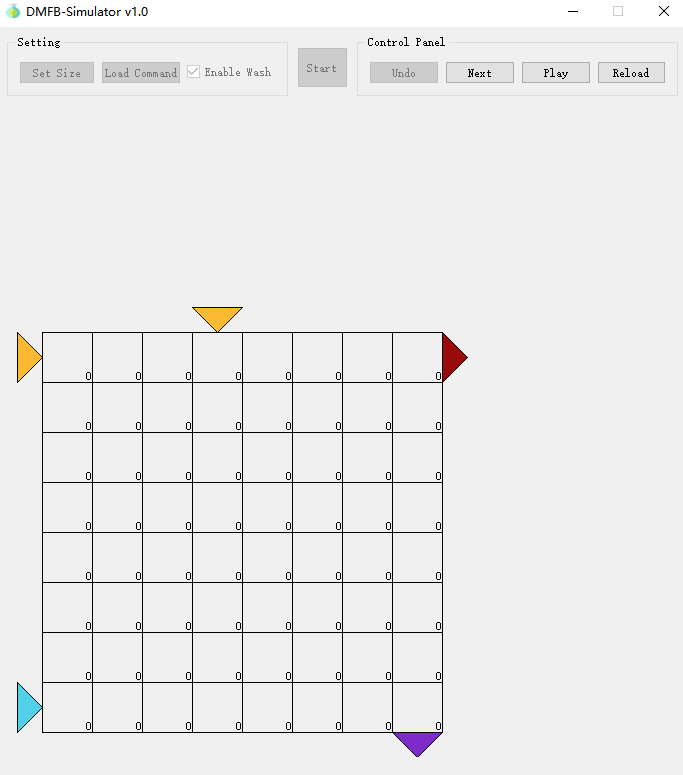
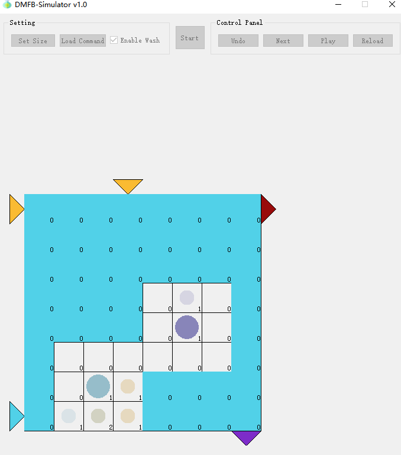
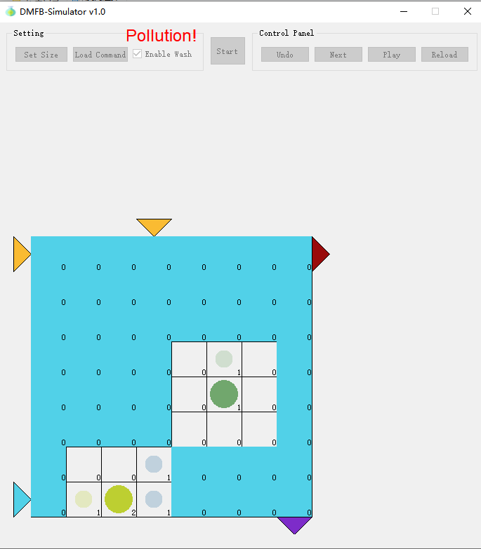
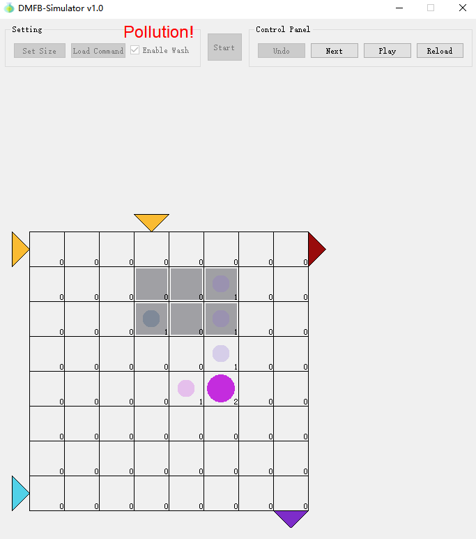

# DMFB-Simulator

## 界面说明与运行流程

### 初期设置

程序运行后，显示主界面，如下图：

顶部按钮，左边的按钮组为开始模拟之前的设置，中间的 **【Start】** 按钮为开始模拟，右边的按钮组为模拟过程中的控制。

点击 **【Set Size】** 后会打开网格参数设置窗口，如下图：

第一行输入 **列数** 和 **行数** （均为 1~12 的整数，且不可同时小于等于3）

第二行左边可以设置多个输入端口，点击 **【Add Input】** ，将打开 **输入端口添加窗口** ，如下图

输入 **X** 和 **Y** 坐标，坐标以网格 **左下角** 为 $(1,1)$ ，向右 **X 增大** ，向上 **Y 增大** 。端口坐标必须在边界上，重复的输入端口会被当成同一个。

输入并点击确定后，"Input Added" 计数器会增大 $1$ ，如果有坐标设置错误，可以点击 **【Clear Input】** ，将输入的 **输入端口** 坐标 **全部清除** 。

在右方可以输入 **输出端口** 的坐标。同样必须在边界上，且不能与输入端口重合。

全部输入完成后，点击确定，程序会对设置的网格大小和端口坐标进行检查，若出现错误会弹窗报错（见错误速查）。这时需要重新点击 **【Set Size】** 进行设置。

如果设置的数据合法，将会绘出初始网格，如下图

其中，黄色箭头表示输入端口，紫色箭头表示输出端口。

之后可以**加载命令**或启用**洗涤功能**

如果勾选了 **【】Enable Wash** ，即启用了 **洗涤功能** ，则还会显示蓝色箭头表示进水口，红色箭头表示废水口。

如果 $(1,1)$ 或 $(Col,Row)$ 已经设置了输入输出端口，则无法启用该功能。

点击 **【Load Command】** 会打开一个文件窗口，选择一个包含命令脚本的文本文件，点击确定。

程序会检查命令脚本格式的合法性，如果出现格式错误会进行报错，并需要重新加载命令。

### 正式模拟

命令加载完成且格式检验通过后， **【Start】** 按钮将可用，点击该按钮即可开始模拟。界面如图：

 **【Undo】 ** ：撤回上一步操作，在启用了清洗功能时，该按钮将被禁用；不存在上一步时该按钮也会被禁用。

 **【Next】 ** ：进行下一步操作，所有命令执行完毕后的一步记为最后一步，处在最后一步时，该按钮会被禁用。

 **【Play】 ** ：持续执行下一步操作直到最后一步，处在最后一步时，该按钮会被禁用。

 **【Reload】 ** ：退回点击 **【Start】** 之前的初始状态，此时可以重新对网格和命令脚本进行设置。

运行过程中如果出现命令错误和约束条件的不满足，会报错并停止执行，此时将只有 **【Reload】** 按钮可用。

在模拟进程中，**功能液滴**以**随机颜色的圆形**表示，其留下的**污染**以**同色的更小圆形**表示，每个格子的右下角用数字标识了该格子上**不同污染的种数**，如果一个格子上有多种污染，小圆形的颜色将为这些污染颜色的混合。

### 清洗相关

如果启用了清洗功能，清洗过程将用染蓝方格表示，清洗水流不会进入液滴周围。无法从入水口出发走到的格子不会被清洗，如果入水口与出水口不存在合法路径，则不进行清洗。

如果因为无法清洗而导致液滴经过**含有同种以外污染**的格子，将会在窗体顶部显示红色的 **”Pollution!“** 字样进行警示：

如果启用了清洗功能，在没有操作正执行时，可以鼠标右键单击网格设置障碍，清洗的水流不会经过障碍格。当正处于 **【Next】** ， **【Play】** 等执行中时，点击鼠标右键将无反应，不会进行障碍设置。

## 脚本规范

 **通用格式检查** ： 命令与数字之间必须用单个空格隔开，数字与数字之间可以使用 `,` （英文逗号）或单个空格隔开，一行结尾必须添加 `;` （英文分号），除此之外不能有多余字符，命令的参数个数必须严格符合规范。

 **静态约束** ： 液滴的所在格和周围一圈不能有其他液滴，分裂中和合并中的液滴的判定范围会相应扩大。所有操作都会检查静态约束。

 **动态约束** ： 当前时刻，任意液滴运动后，不能有任何一部分处在其他液滴运动前的判定范围中。

- `Input t,x1,y1; ` 在 $t$ 时刻将一个液滴输入到 $(x1,y1)$ 位置
  - 格式检查： 通用。
  - 运行检查： 该位置必须有输入端口。检查动态约束。
- `Output t,x1,y1; ` 在 $t$ 时刻将一个 $(x1,y1)$ 位置的液滴输出
  - 格式检查： 通用。
  - 运行检查： 该位置必须有液滴，且必须有输出端口。
- `Move t,x1,y1,x2,y2;` 将 $t$ 时刻在 $(x1,y1)$ 位置的液滴移动到 $(x2,y2)$ ，每个单位时间液滴只能横向或纵向移动一格。
  - 格式检查： $(x1,y1)$ 与 $(x2,y2)$ 必须相邻。
  - 运行检查： 该时刻 $(x1,y1)$ 必须有液滴，该液滴本时刻未进行其他操作。 $(x2,y2)$ 必须在网格中。检查动态约束。
- `Mix t,x1,y1,x2,y2,...,xn,yn;` 将 $t$ 时刻在 $(x1,y1)$ 位置的液滴，沿着 $(x1,y1), (x2,y2), ..., (xn,yn)$ 的路线进行混合操作，到达 $(xn,yn)$ 时混合完成，耗时为 $n-1$ 个单位时间。
  - 格式检查：参数个数必须为奇数，至少为 $5$ 。输入中相邻的任意两个位置必须在网格中相邻。
  - 运行检查：与 `Move` 一致。

- `Split t,x1,y1,x2,y2,x3,y3;` 将 $t$ 时刻在 $(x1,y1)$ 位置的液滴分成 $(x2,y2), (x3,y3)$ 两个液滴。消耗 $2$ 个单位时间，当时刻将液滴拉伸，下一时刻生成两个新的液滴。
  - 格式检查：$(x2,y2)$ 与 $(x3,y3)$ 必须间隔一格（水平或垂直），如果 $(x1,y1)$ 不处在这两格之间，则会报错但仍然能正确载入命令。
  - 运行检查：该时刻 $(x1,y1)$ 必须有液滴，该液滴本时刻未进行其他操作，分裂到的两格必须合法。检查动态约束。
- `Merge t,x1,y1,x2,y2;` 将 $t$ 时刻在 $(x1,y1)$ 位置和 $(x2,y2)$ 位置的两个液滴液滴合并到两个坐标的中间位置。消耗 $2$ 个单位时间，当时刻将两液滴合并为一个拉伸状态的新液滴，下一时刻新液滴形状变为单点。
  - 格式检查：$(x1,y1)$ 与 $(x2,y2)$ 必须间隔一格（水平或垂直）。
  - 运行检查：$(x1,y1)$ 与 $(x2,y2)$ 必须有液滴。

## 错误速查

- `Please set size first.`

  在设置网格参数之前点击了 **【Load Command】** 。

- `Failed to open file.`

  无法打开选择的文件。

- `Command format error.`

  命令脚本存在格式错误，这可能是由于错误的分隔符、缺少的参数或多余的字符引起的，请仔细检查命令脚本的格式。

- `XXX Command at t=%1 has wrong argument.`

  某一个命令参数未通过验证，参数个数可能合法，但参数之间的关系不合法。 `XXX` 和 `%1` 会根据具体出错的位置而改变。

- `Split Command at t=%1 has wrong (x1,y1), but may not cause fatal error.`

  某一个分裂命令出现非致命错误。 `%1` 会根据具体出错位置改变。仅作为警示。

- `Static check failed!`

  执行下一时刻的操作后不满足**静态约束**。

- `Invalid Input: No Input here!`

  输入命令所指定的格子不合法（越界），或者此处没有输入端口。

- `Invalid Input: Dynamic check failed!`

  输入命令不满足**动态约束**。

- `Invalid Output: No Output here!`

  输出命令所指定的格子不合法（越界），或者此处没有输出端口。

- `Invalid Output: No Drop here!`

  输出命令所指定的格子上没有液滴，或该液滴在当前时刻进行了其他操作。

- `Invalid Move: Move from/to invalid position!`

  移动命令所指定的格子（越界）。

- `Invalid Move: No Drop here!`

  移动命令所指定的格子上没有液滴，或该液滴在当前时刻进行了其他操作。

- `Invalid Move: The Drop is Splitting/Merging here!`

  移动命令所指定的格子上的液滴处于拉伸状态中。

- `Invalid Move: Dynamic check failed!`

  移动命令不满足**动态约束**。

- `Invalid Split: Split at invalid position`

  分裂命令所指定的格子不合法（越界）。

- `Invalid Split: No Drop here!`

  分裂命令所指定的格子上没有液滴，或液滴在当前时刻进行了其他操作。

- `Invalid Split: Dynamic check failed!`

  分裂命令不满足**动态约束**。

- `Invalid Merge: Merge at invalid position`

  合并命令所指定的格子不合法（越界）。

- `Invalid Merge: No Drop here!`

  合并命令所指定的格子上没有液滴，或液滴在当前时刻进行了其他操作。